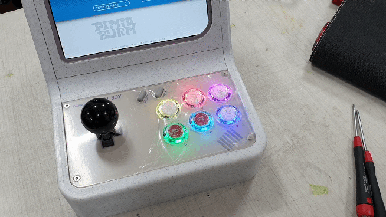
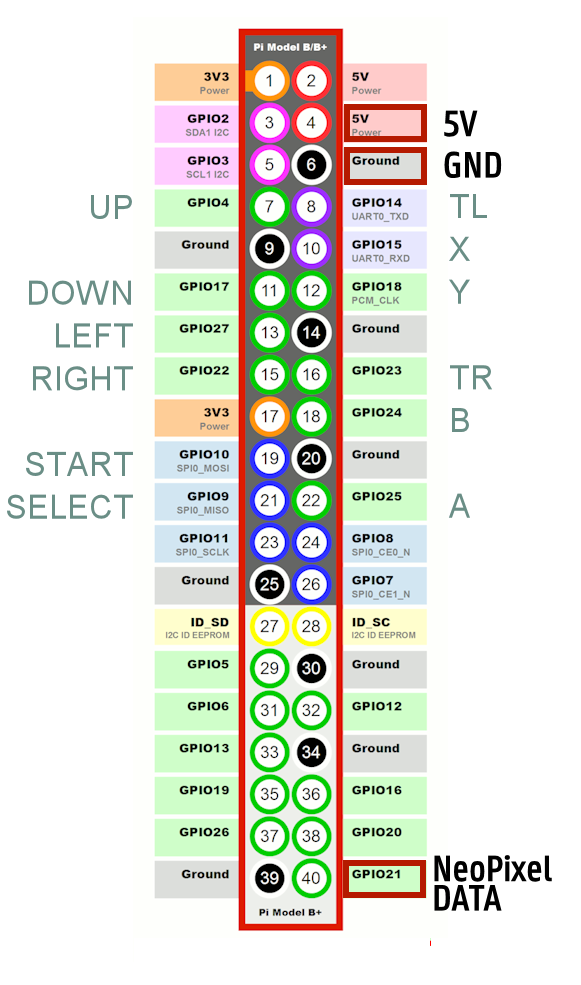

# Bright NeoPixel for RPI retropie
WS2812b control for GPIO Joystick driver\

Can be used with :
https://github.com/amos42/am_joyin
https://github.com/recalbox/mk_arcade_joystick_rpi
https://github.com/cmitu/mk_arcade_joystick_rpi/tree/retropie




## How to use


### Install
```
sudo python3 -m pip install --force-reinstall adafruit-blinka
sudo python3 -m pip install rpi_ws281x adafruit-circuitpython-neopixel
cd /home/pi
git clone https://github.com/losernator/brpixel4rpi.git
```
Add this to first line of /opt/retropie/configs/all/autostart.sh  
`sudo python3 /home/pi/brpixel4rpi/brpixel4pi.py &`

### Options:
- Edit 'configs.py' for custom setup

## License
MIT
